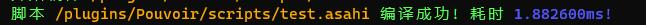
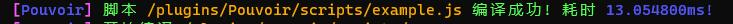
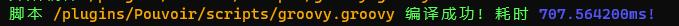
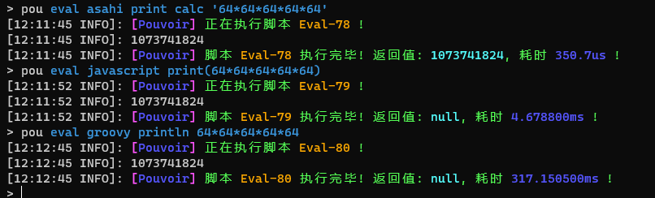

# Asahi

高速编译执行的动态脚本语言

---

## 兼容

| 说明         | 内容      |
|------------|---------|
| 建议JDK      | 1.8+    |
| 建议Kotlin版本 | 1.7.20+ |

> Kotlin 1.7 的可以帮助您推断更多的泛型类型

## 介绍

**Asahi** 是基于 **TabooLib VI-Platform Application** 编写的一门动态脚本语言

**Asahi**拥有着优异的编译速度与执行速度
> jdk8环境下 主流实现jsr223语言的编译速度对比




> jdk8环境下 主流实现jsr223语言的执行性能对比


基于**Asahi**优异的架构，您可以仅通过编写简单的代码来快速拓展其**解释器**

> 前缀解释器 - 根据下一个Token来选择解释器  
> 如果前缀解释器的名称中包含下一个Token 则选择当前的前缀解释器

```kotlin
//声明         名称     命名空间
@AsahiPrefix(["floor"], "lang")
fun floor() = prefixParser {
        //          寻求一个数字
        val number = quest<Double>()
        //返回结果                  获取寻求的数字
        result { kotlin.math.floor(number.get()) }
    }
```

```kotlin
//使用
import com.skillw.asahi.api.AsahiAPI.asahi

"print floor 114.514".asahi()
```

> 语法小课堂
> **Token**是语法分析中的最小处理单元 单词，符号，字面量等等都会在编译的阶段转换为一个个Token  
> 例如: `floor 114.514` 会被拆分成 [ `floor` , `114.514` ]

> 类型解释器 - 根据所需要的类型来选择解释器

```kotlin
//声明
@AsahiTypeParser
//                       类型
fun pair() = typeParser(Pair::class.java) {
        //寻求第一个对象
        val first = quest<Any?>()
        //预期下一个Token是 [ "to", "=", ":" ] 中的一个
        //预期成功或失败都将继续执行，在这里预期只是为了跳过这几个Token
        expect("to", "=", ":")
        //寻求第二个对象
        val second = quest<Any?>()
        //返回结果        构建Pair对象
        quester { first.get() to second.get() }
    }
```

```kotlin
//声明         名称     命名空间
@AsahiPrefix(["printPair"], "lang")
fun printPair() = prefixParser {
        //          寻求一个Pair 注意这里泛型中的Pair类型 将会选择上面的`pair`类型解释器 作为解释器
        val pair = quest<Pair<Any?, Any?>>()
        //返回结果                  获取寻求的数字
        result { println(pair.first + " = " + pair.second) }
    }
```

```kotlin
//使用
import com.skillw.asahi.api.AsahiAPI.asahi

"printPair 1919810 to 114514".asahi()
//打印 1919810 = 114514
```

> 中缀解释器 - 基于对象类型选择解释器

```kotlin
//声明
@AsahiInfix
//                             类型         类型的类
object ActionPair : BaseInfix<Pair<*, *>>(Pair::class.java) {
    init {
        "key" to { it.first }
        "value" to { it.second }
    }
}
```

```kotlin
//使用
import com.skillw.asahi.api.AsahiAPI.asahi

"print pair 'Hello' to 'World' first".asahi()
//打印 Hello
```

## 使用

！！当前Asahi还在dev阶段，请勿用于实际生产环境中！！

直接将源码CV到你的项目中（Maven在建了）
如果您的生产环境中有其它包含asahi的项目，请记得使用重定向!

在项目**初始化阶段**调用以下方法

```kotlin
import com.skillw.asahi.internal.AsahiLoader

AsahiLoader.init("你的包名")
```

## Links

WIKI [https://www.skillw.com/docs/pouvoir/other/asahi](https://www.skillw.com/docs/pouvoir/other/asahi)

爱发电 [https://afdian.net/@glom\_](https://afdian.net/@glom_)
